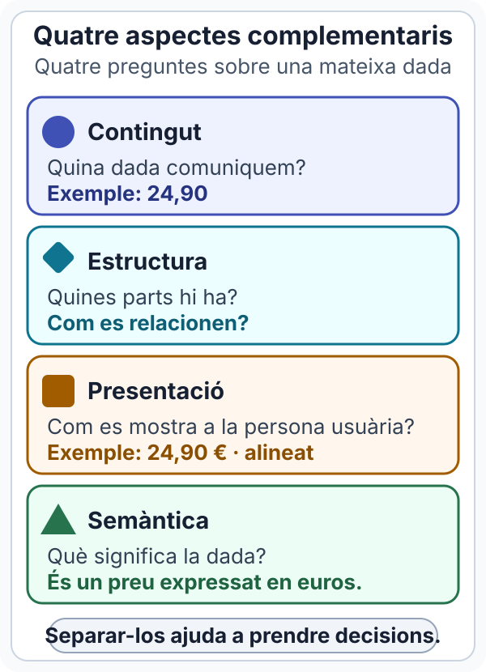
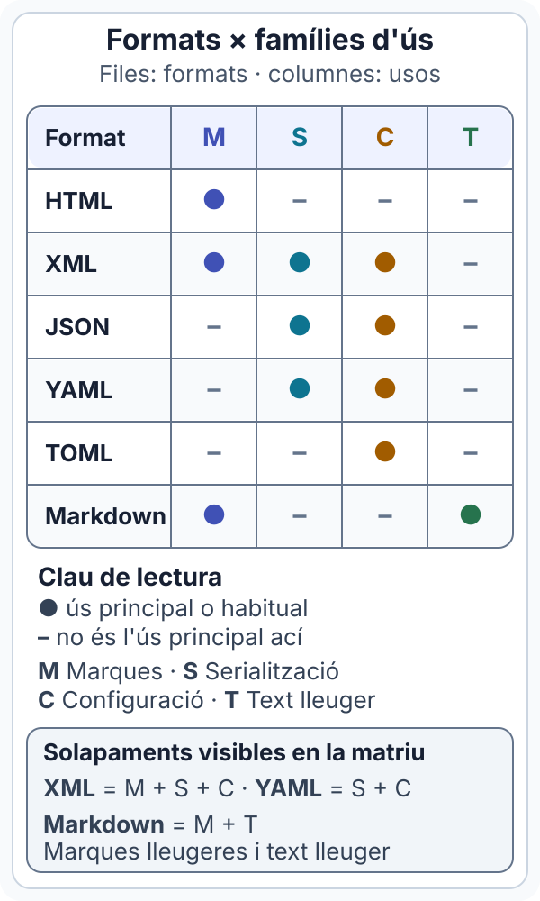
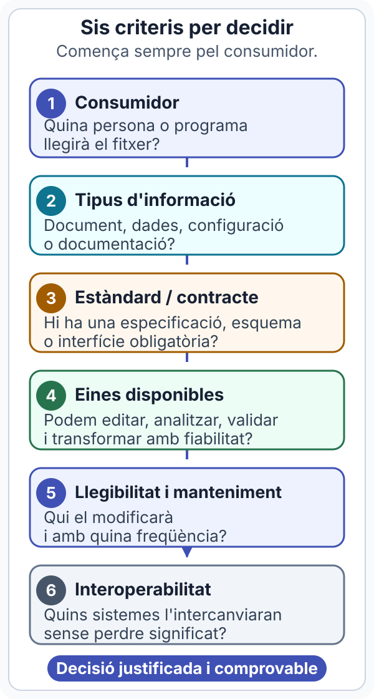
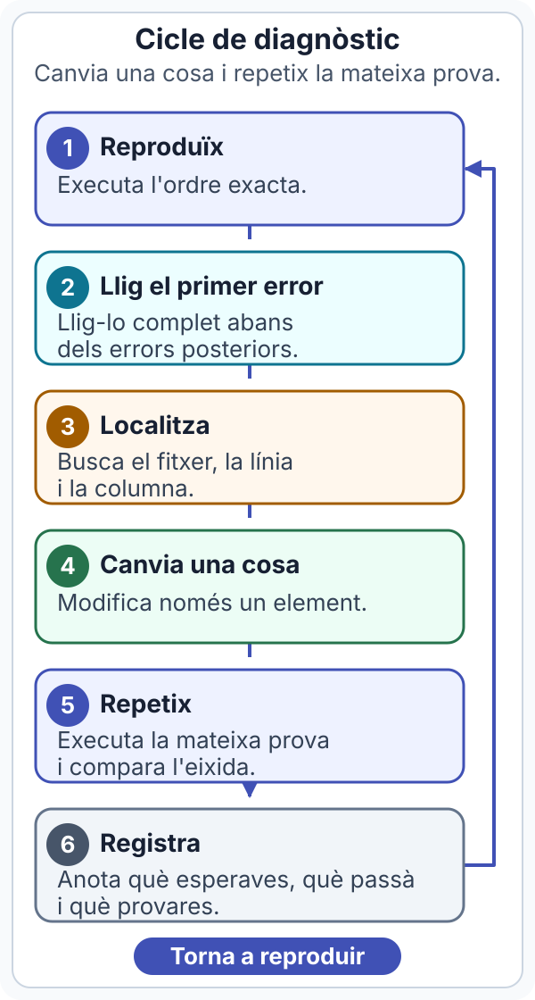

# 0. Punt de partida: informació i eines

## :material-map-outline: Abans de començar

| Aspecte | Orientació |
|---|---|
| **Propòsit** | Entendre per què estructurem informació i preparar una manera de treballar que permeta editar, comprovar i versionar fitxers de text. |
| **Duració orientativa** | 2 setmanes, inclosos l'exemple guiat, la pràctica autònoma i el minirepte. |
| **Coneixements previs** | Crear, guardar i localitzar fitxers i carpetes; usar un navegador. No cal conéixer HTML, XML, JSON ni Git. |
| **Posició en el curs** | És la introducció comuna abans d'aprofundir en HTML, XML, JSON i YAML. Es relaciona metodològicament amb RA1. |

!!! note "Sobre els objectius"
    Els objectius següents són metes observables creades per organitzar esta unitat. No són una transcripció de resultats d'aprenentatge ni de criteris oficials.

### En acabar podràs

- separar el contingut, l'estructura, la presentació i la semàntica d'una informació;
- reconéixer la funció inicial d'HTML, XML, JSON, YAML, TOML i Markdown;
- justificar una elecció de format segons qui consumirà la informació i amb quines eines;
- preparar un entorn mínim amb editor, navegador, terminal, analitzador sintàctic i Git;
- organitzar un projecte amb noms previsibles i rutes relatives;
- comprovar la sintaxi d'un XML i d'un JSON amb una ordre reproduïble;
- crear un repositori Git local i registrar un primer canvi;
- documentar un error de manera que una altra persona el puga reproduir.

### Ruta de treball semipresencial

Una distribució possible és esta:

| Moment | Treball concret |
|---|---|
| **Abans de la sessió 1** | Llig les seccions 1 i 2. Intenta l'activació inicial i les activitats curtes 1 i 2. |
| **Sessió guiada 1** | Contrasta les activitats inicials, recorre la història mínima de la secció 3 i compara els sis exemples de la secció 4. |
| **Treball autònom 1** | Llig la secció 5 i completa l'activitat curta 3 amb quatre decisions justificades. |
| **Abans de la sessió 2** | Llig les seccions 6 i 7, comprova si disposes de Python 3 i Git, i crea la carpeta de treball. |
| **Sessió guiada 2** | Reproduïx l'exemple complet de la secció 8, inclosa la prova negativa amb `NaN`, i aplica el cicle de diagnòstic de la secció 9 al primer error. |
| **Treball autònom 2** | Completa la pràctica de la secció 10, el minirepte de la secció 11 i l'autoavaluació de la secció 12. |

Esta seqüència permet arribar a cada sessió amb un intent propi i reserva l'acompanyament per a les decisions i els primers errors. Per a orientacions generals sobre el ritme o sobre com demanar ajuda, consulta la [guia del mòdul](../guia/index.md).

## :material-layers-outline: 1. De text solt a informació estructurada

### Activació inicial

Llig esta nota d'un catàleg fictici:

```text title="Informació sense estructurar"
Teclat USB P-001 24,90 EUR sí; Ratolí òptic P-002 18,50 EUR no
```

Una persona pot deduir què significa cada tros. Una aplicació ho té més difícil:

- On acaba el nom de cada producte?
- `sí` indica disponibilitat, acceptació o una altra cosa?
- Els dos imports usen la mateixa moneda?
- Com afegiríem una categoria sense trencar la lectura anterior?

**Abans de continuar**, reescriu la nota amb una línia per producte i posa un nom davant de cada dada. No cal usar cap format conegut.

Una possible organització visual seria:

| Codi | Nom | Preu | Moneda | Disponible |
|---|---|---:|---|---|
| P-001 | Teclat USB | 24,90 | EUR | sí |
| P-002 | Ratolí òptic | 18,50 | EUR | no |

Ara les parts són identificables. Hem introduït **estructura**, encara que no hem triat un format de fitxer.

### Quatre aspectes que convé separar

| Aspecte | Pregunta que respon | Exemple |
|---|---|---|
| **Contingut** | Quina informació comuniquem? | `24,90` |
| **Estructura** | Quines parts hi ha i com es relacionen? | un preu pertany a un producte |
| **Presentació** | Com es mostra a la persona usuària? | `24,90 €` en negreta i alineat a la dreta |
| **Semàntica** | Què significa cada part? | és un preu expressat en euros, no una quantitat d'unitats |

{ role="img" }

*Una mateixa dada es pot llegir des de quatre aspectes complementaris.*

La **semàntica** és el significat. Una etiqueta anomenada `price`, un atribut `currency="EUR"` o una capçalera de taula «Preu» aporten pistes perquè persones i programes interpreten la dada.

La **presentació** no hauria de ser l'única pista. Si només distingim els productes disponibles amb color verd, una màquina, una impressió en blanc i negre o una persona que no perceba eixe color pot perdre la informació.

!!! example "Activitat curta 1 · Posa nom a les dades"
    **Objectiu:** distingir contingut i estructura.

    **Punt de partida:** `Auriculars A-014 39,95 EUR estoc 8`.

    **Resultat observable:** una taula o un esquema amb cinc camps identificats.

    **Comprovació:** una altra persona ha de poder assenyalar el codi, el nom, el preu, la moneda i l'estoc sense demanar aclariments.

## :material-shape-outline: 2. Famílies de llenguatges i formats

No tot el text estructurat és un llenguatge de marques. Estes definicions servixen per començar:

| Concepte | Definició | Exemples habituals |
|---|---|---|
| **Llenguatge de marques** | Sistema de marques integrades en un document per descriure'n l'estructura o el significat. | HTML, XML, SVG |
| **Format de serialització** | Convenció per convertir una estructura de dades en una seqüència que es puga guardar o transmetre i reconstruir després. | JSON, YAML, XML |
| **Format o llenguatge de configuració** | Sintaxi usada per declarar opcions i paràmetres que una eina llegirà. Descriu què configurar, no els passos d'un algorisme. | TOML, YAML, JSON, XML |
| **Llenguatge de text lleuger** | Sintaxi textual reduïda que dona estructura bàsica a documents fàcils de llegir també en brut. | Markdown |
| **Llenguatge de programació** | Llenguatge formal que permet expressar dades i operacions, inclòs el control del que executarà un sistema. | JavaScript, Python, Java |

Les categories **se solapen segons l'ús**. XML és un llenguatge de marques i també pot serialitzar dades o guardar configuració. YAML és un format de serialització que s'usa sovint per configurar eines. Markdown també es descriu habitualment com a llenguatge de marques lleuger.

En canvi, el fet que JSON nasquera a partir de la sintaxi de JavaScript no el convertix en un llenguatge de programació. JSON representa dades: no incorpora bucles, funcions ni instruccions de control.

{ role="img" }

*La matriu relaciona cada format amb els usos principals, però el context concret continua sent decisiu.*

!!! warning "L'extensió no garantix el contingut"
    Anomenar `catalog.json` un fitxer no fa que siga JSON correcte. L'extensió orienta les eines; un analitzador ha de comprovar que el contingut respecta la sintaxi.

### Activitat curta 2 · Classifica sense forçar una sola caixa

**Objectiu:** reconéixer categories i solapaments.

**Punt de partida:** classifica `index.html`, `catalog.json`, `mkdocs.yml`, `pyproject.toml`, `README.md` i `app.py`.

**Resultat observable:** una taula amb el fitxer, la categoria principal en eixe ús i una justificació d'una frase.

**Comprovació:** has d'indicar almenys un cas que podria pertànyer a dues categories i explicar per què.

## :material-history: 3. Història mínima per entendre el present

La història importa perquè explica d'on venen algunes decisions, no perquè calga memoritzar dates.

```text title="Evolució resumida"
GML ──> SGML ──┬──> HTML ──> HTML Living Standard
               └──> XML 1.0
```

**Lectura textual de l'esquema:** GML va introduir una manera de descriure l'estructura dels documents. SGML va formalitzar esta tradició com a metallenguatge. HTML es va crear per als documents de la web i XML va simplificar principis procedents de SGML per facilitar l'intercanvi i el processament. L'HTML actual evoluciona com un estàndard viu.

- **GML** va mostrar que es podia marcar la funció d'una part del document i separar-la de la seua aparença.
- **SGML** va permetre definir llenguatges de marques. La seua influència és important, però no serà una eina de treball quotidiana en el curs.
- **HTML** va aplicar esta tradició a documents enllaçats de la web. Hui és el llenguatge semàntic central de la plataforma web.
- **XML** va oferir una sintaxi estricta i extensible per crear vocabularis i intercanviar documents estructurats.

La conclusió pràctica és que HTML i XML compartixen una tradició, però no tenen exactament les mateixes regles ni la mateixa finalitat. Les [unitats 1](01-html-semantic.md) i [3](03-xml.md) ho desenvoluparan.

## :material-file-code-outline: 4. Una primera mirada a sis formats

Usarem un mateix model conceptual sempre que siga raonable:

- catàleg amb moneda `EUR`;
- un producte amb codi `P-001`;
- nom `Teclat USB`;
- preu `24.90`;
- disponibilitat certa.

L'objectiu encara no és memoritzar tota la sintaxi, sinó localitzar la jerarquia i identificar com s'expressen els noms i els valors.

### HTML: un document per a la web

HTML usa elements amb significat compartit pel navegador i altres tecnologies web. En este cas crea un document que una persona pot consultar; no pretén ser una còpia exacta d'una estructura d'objectes.

```html title="catalog.html"
<!doctype html>
<html lang="ca">
  <head>
    <meta charset="utf-8">
    <title>Catàleg</title>
  </head>
  <body>
    <main>
      <h1>Catàleg</h1>
      <p>Moneda: EUR</p>
      <article>
        <h2>Teclat USB</h2>
        <p>Codi: <code>P-001</code></p>
        <p>Preu: <data value="24.90">24,90 €</data></p>
        <p>Disponible</p>
      </article>
    </main>
  </body>
</html>
```

`h1`, `article` i `data` aporten estructura o semàntica. La presentació visual es treballaria amb CSS. La [unitat 1](01-html-semantic.md) aprofundirà en documents HTML complets, semàntica i accessibilitat.

### XML: marques amb vocabulari propi

XML permet definir noms d'elements i atributs adequats al domini del problema.

```xml title="catalog.xml"
<?xml version="1.0" encoding="UTF-8"?>
<catalog currency="EUR">
  <product code="P-001">
    <name>Teclat USB</name>
    <price>24.90</price>
    <available>true</available>
  </product>
</catalog>
```

`catalog` és l'element arrel; `product` depén d'ell; `currency` i `code` són atributs. Sense un esquema, el text `24.90` no té per si mateix un tipus numèric declarat. La unitat 3 aprofundirà en XML i la unitat 4, en la validació amb contractes.

### JSON: objectes, arrays i valors tipats

JSON representa dades amb objectes `{}`, arrays `[]`, nombres, cadenes, booleans i `null`.

```json title="catalog.json"
{
  "currency": "EUR",
  "products": [
    {
      "code": "P-001",
      "name": "Teclat USB",
      "price": 24.90,
      "available": true
    }
  ]
}
```

Les claus van entre cometes dobles. `products` conté un array i `price` és un nombre, no una cadena.

### YAML: jerarquia basada en la indentació

YAML també serialitza dades. És freqüent en configuració perquè pot resultar llegible quan la jerarquia és moderada.

```yaml title="catalog.yaml"
currency: EUR
products:
  - code: P-001
    name: Teclat USB
    price: 24.90
    available: true
```

Els espais inicials indiquen dependència i els guions introduïxen elements d'una seqüència. No uses tabuladors per indentar YAML.

### TOML: configuració explícita

TOML està orientat a fitxers de configuració previsibles. Les dobles claus quadrades creen elements repetits dins d'una llista de taules.

```toml title="catalog.toml"
currency = "EUR"

[[products]]
code = "P-001"
name = "Teclat USB"
price = 24.90
available = true
```

### Markdown: documentació llegible en brut

Markdown dona estructura a documentació de text pla. Un renderitzador transforma els marcadors en encapçalaments, llistes o èmfasi.

```markdown title="catalog.md"
# Catàleg

**Moneda:** EUR

## Teclat USB

- Codi: `P-001`
- Preu: 24,90 €
- Disponible: sí
```

Markdown comunica bé el catàleg a una persona, però no conserva necessàriament els mateixos tipus i relacions que JSON, YAML o TOML.

### Comparació inicial

| Format | Família principal en este exemple | Consumidor habitual | Pista visual | Atenció |
|---|---|---|---|---|
| **HTML** | marques per a documents web | navegador i tecnologies web | elements predefinits | estructura i aparença no són el mateix |
| **XML** | marques i serialització | aplicació o sistema documental | etiquetes pròpies | sintaxi estricta i més verbosa |
| **JSON** | serialització | API o aplicació | claus, objectes i arrays | no admet comentaris en l'estàndard JSON |
| **YAML** | serialització i configuració | eines de desplegament i automatització | indentació | un canvi d'espais pot alterar la jerarquia |
| **TOML** | configuració | eina que espera eixe contracte | parelles clau-valor i taules | no substituïx un format exigit per l'eina |
| **Markdown** | text lleuger | persones i renderitzadors de documentació | `#`, llistes i èmfasi | hi ha dialectes; CommonMark fixa una base comuna |

!!! info "No hi ha un format universalment millor"
    Els formats conviuen perquè resolen problemes diferents. Una aplicació web pot usar HTML per a la pàgina, JSON per a dades, YAML per a automatització, TOML per a una eina i Markdown per a la documentació.

## :material-source-branch: 5. Com triar un format

Comença pel **consumidor**, és a dir, la persona o el programa que ha de llegir la informació. Després valora estos criteris:

1. **Consumidor:** què admet el navegador, l'API, la biblioteca o l'eina?
2. **Tipus d'informació:** és un document amb text, una col·lecció de dades, una configuració o documentació?
3. **Estàndard o contracte:** hi ha una especificació, un esquema o una interfície que obliga a usar un format concret?
4. **Eines disponibles:** podem editar, analitzar, validar i transformar el format de manera fiable?
5. **Llegibilitat i manteniment:** qui el modificarà i amb quina freqüència?
6. **Interoperabilitat:** quins sistemes han d'intercanviar la informació sense perdre significat?

{ role="img" }

*El recorregut ordena les preguntes: primer les restriccions, després la preferència.*

La preferència personal va després del contracte. Si una eina exigix `pyproject.toml`, convertir-lo a YAML perquè ens parega més llegible no resoldrà el problema.

!!! example "Activitat curta 3 · Decidix a partir del consumidor"
    **Objectiu:** justificar una elecció, no endevinar un «guanyador».

    **Punt de partida:** una pàgina web accessible, una resposta d'una API, la configuració d'una eina i el `README` d'un repositori.

    **Resultat observable:** quatre decisions amb el format principal i una justificació basada en dos criteris de la llista anterior.

    **Comprovació:** cada resposta identifica primer qui o què consumirà el fitxer. Pot haver-hi alternatives correctes si el context les justifica.

## :material-tools: 6. Entorn mínim de treball

No cal usar un sistema operatiu, editor o extensió concrets. Sí que necessitem cobrir cinc funcions:

| Funció | Eina possible | Comprovació mínima |
|---|---|---|
| Editar text i codi | qualsevol editor de codi o text pla | guarda en UTF-8 i mostra l'extensió real |
| Observar documents web | un navegador actual | obri un fitxer local HTML o XML |
| Executar ordres | terminal del sistema o terminal integrada | mostra la carpeta actual i executa una ordre |
| Analitzar sintaxi | analitzador de l'editor, Python o un servei de confiança | detecta un error introduït a propòsit |
| Versionar | Git | `git --version` mostra una versió instal·lada |

!!! warning "Editor de text no és processador de textos"
    Un processador de textos pot afegir format invisible o canviar les cometes. Guarda els exemples com a text pla amb l'extensió indicada, no com a `.docx`, `.odt` o `.rtf`.

### Comprova les eines disponibles

```bash title="Ordre · Comprovar Git"
git --version
```

```text title="Eixida d'exemple"
git version 2.51.0
```

El número pot ser diferent. Si l'ordre no existix, instal·la Git des de la documentació oficial o seguix el procediment del centre.

Per analitzar XML i JSON usarem només la biblioteca estàndard de Python. Prova una d'estes ordres:

```bash title="Ordre · Comprovar Python"
python3 --version
```

```text title="Eixida d'exemple"
Python 3.13.7
```

- En molts sistemes GNU/Linux i macOS l'ordre és `python3`.
- En Windows pot ser `python` o `py -3`.
- Tria l'ordre que mostre Python 3 i substituïx `python3` per eixa forma en els exemples següents.

Els números de versió mostrats són eixides d'exemple, no requisits mínims de la unitat.

### Analitzar no sempre és validar

Un **analitzador sintàctic** o *parser* llig el text segons les regles del format i intenta construir-ne l'estructura. Un **validador** comprova, a més, si el document complix un contracte determinat.

En XML cal distingir:

- **XML ben format:** complix les regles sintàctiques d'XML; té una única arrel, etiquetes ben niades i atributs entre cometes, entre altres condicions.
- **XML vàlid:** és ben format i, a més, complix una gramàtica o un esquema concret, com ara DTD o XSD.

En esta unitat només comprovarem que l'XML està **ben format**. Encara no tenim cap esquema contra el qual validar-lo.

En JSON també cal un matís. L'RFC 8259 no admet els valors numèrics especials `NaN`, `Infinity` ni `-Infinity`. El descodificador `json.loads()` de Python els accepta per defecte com una extensió. Per fer una comprovació estricta usarem el paràmetre `parse_constant`: quan trobe una d'eixes constants, la funció configurada provocarà un error.

La part que comença per `reject =` és un mecanisme compacte per generar eixe error sense instal·lar cap paquet. No cal memoritzar-la: copia l'ordre completa i canvia només la ruta del fitxer quan corresponga.

Per a HTML pots usar el navegador durant l'edició i, quan calga comprovar conformitat, el [Nu HTML Checker](https://validator.w3.org/nu/). Per a XML, JSON, YAML o TOML pots usar un analitzador local, el suport de l'editor o una eina web de confiança.

!!! danger "No puges informació sensible a un validador web"
    No compartisques contrasenyes, tokens, claus d'API, dades personals ni configuracions reals. Per a les pràctiques usa sempre dades fictícies.

## :material-folder-outline: 7. Organització, noms i rutes

Una estructura previsible facilita que una altra persona execute les mateixes comprovacions.

### Convencions inicials

- usa noms curts i descriptius: `catalog.json`, no `cosafinal2.json`;
- usa minúscules i guions en carpetes: `unitat-0-cataleg`;
- evita espais, accents i símbols en noms que s'usaran des de la terminal;
- conserva l'extensió que correspon al contingut;
- no dupliques el mateix fitxer amb noms com `final`, `final-bo` i `final-definitiu`: usa Git per conservar versions;
- mantín `README.md` com a excepció convencional fàcil de reconéixer.

Un projecte menut pot començar així:

```text title="Arbre del projecte"
unitat-0-cataleg/
├── README.md
├── catalog.json
└── catalog.xml
```

L'arbre és text: la carpeta arrel conté un document d'instruccions i dues representacions del catàleg. Si el projecte cresquera, podríem moure les dades a una carpeta `data/`, però ara afegiria navegació sense aportar claredat.

### Rutes relatives

Una **ruta relativa** indica on està un recurs a partir de la ubicació actual. No depén del nom de la carpeta personal ni del disc de l'equip.

En esta estructura, des de `README.md`:

- `catalog.json` apunta al JSON de la mateixa carpeta;
- `./catalog.xml` també apunta a un fitxer de la mateixa carpeta;
- si `README.md` estiguera dins de `docs/`, `../catalog.json` pujaria un nivell i buscaria el JSON.

Evita documentar rutes absolutes com `/Users/nom/projecte/catalog.json` o `C:\Users\nom\projecte\catalog.json`: només funcionen en un equip concret i poden revelar informació privada.

## :material-play-circle-outline: 8. Exemple guiat: el primer catàleg versionat

Crearem el projecte complet pas a pas. Escriu els fitxers amb l'editor; usa la terminal per crear la carpeta, comprovar la sintaxi i treballar amb Git.

### Pas 1. Crea i obri la carpeta

Les ordres `mkdir` i `cd` estan disponibles en els terminals habituals de Windows, macOS i GNU/Linux.

```bash title="Ordres · Crear la carpeta de treball"
mkdir unitat-0-cataleg
cd unitat-0-cataleg
```

Obri `unitat-0-cataleg` amb el teu editor. Comprova que els fitxers nous es guardaran dins d'eixa carpeta.

### Pas 2. Crea la representació XML

Crea `catalog.xml` amb este contingut:

```xml title="catalog.xml"
<?xml version="1.0" encoding="UTF-8"?>
<catalog currency="EUR">
  <product code="P-001">
    <name>Teclat USB</name>
    <price>24.90</price>
    <available>true</available>
  </product>
  <product code="P-002">
    <name>Ratolí òptic</name>
    <price>18.50</price>
    <available>false</available>
  </product>
</catalog>
```

**Decisions preses:**

- `catalog` és l'única arrel i agrupa els productes;
- la moneda és comuna al catàleg i s'expressa una sola vegada;
- cada `product` té la mateixa estructura;
- `code` identifica el producte dins de l'exemple;
- els preus usen punt decimal per mantindre una representació tècnica consistent.

### Pas 3. Representa la mateixa informació en JSON

Crea `catalog.json`:

```json title="catalog.json"
{
  "currency": "EUR",
  "products": [
    {
      "code": "P-001",
      "name": "Teclat USB",
      "price": 24.90,
      "available": true
    },
    {
      "code": "P-002",
      "name": "Ratolí òptic",
      "price": 18.50,
      "available": false
    }
  ]
}
```

El model conceptual és el mateix, però no totes les peces tenen una traducció caràcter per caràcter. L'atribut XML `currency` passa a ser una clau JSON i els elements `product` passen a ser objectes d'un array.

### Pas 4. Comprova els dos fitxers

Executa les ordres des de `unitat-0-cataleg`:

```bash title="Ordre · Comprovar que l'XML està ben format"
python3 -c "import xml.etree.ElementTree as ET; ET.parse('catalog.xml'); print('XML ben format')"
```

```text title="Eixida esperada"
XML ben format
```

Esta ordre analitza la sintaxi. No afirma que el document siga vàlid contra un esquema.

```bash title="Ordre · Comprovar JSON de manera estricta"
python3 -c "import json, pathlib; reject = lambda value: (_ for _ in ()).throw(ValueError('Constant JSON no permesa: ' + value)); json.loads(pathlib.Path('catalog.json').read_text(encoding='utf-8'), parse_constant=reject); print('JSON conforme a RFC 8259')"
```

```text title="Eixida esperada"
JSON conforme a RFC 8259
```

Si uses `python` o `py -3`, canvia només el nom inicial de l'ordre. Si no tens Python disponible, usa un analitzador integrat en l'editor o una eina local equivalent i anota exactament quina has usat.

#### Prova negativa: comprova que `NaN` es rebutja

Crea temporalment `catalog-nan.json`:

```json title="catalog-nan.json · Exemple deliberadament no conforme"
{
  "price": NaN
}
```

Executa la mateixa comprovació estricta sobre el fitxer:

```bash title="Ordre · Prova negativa JSON"
python3 -c "import json, pathlib; reject = lambda value: (_ for _ in ()).throw(ValueError('Constant JSON no permesa: ' + value)); json.loads(pathlib.Path('catalog-nan.json').read_text(encoding='utf-8'), parse_constant=reject); print('JSON conforme a RFC 8259')"
```

La prova és correcta si l'ordre acaba amb codi d'eixida diferent de zero i l'última línia informa del valor rebutjat:

```text title="Última línia esperada de l'error"
ValueError: Constant JSON no permesa: NaN
```

No ha d'aparéixer el missatge `JSON conforme a RFC 8259`. Elimina `catalog-nan.json` amb l'editor després de verificar la prova; és un fitxer incorrecte creat només per confirmar que l'analitzador detecta eixe cas.

### Pas 5. Documenta el projecte

Crea `README.md`:

```markdown title="README.md"
# Catàleg inicial

Exemple fictici de la unitat 0.

## Fitxers

- `catalog.xml`: catàleg expressat amb marques XML.
- `catalog.json`: les mateixes dades serialitzades com a JSON.

## Comprovacions

- XML: analitzat amb `xml.etree.ElementTree` de Python.
- JSON: analitzat amb el mòdul `json` de Python i rebuig explícit de constants no admeses per l'RFC 8259.
```

El `README` explica què trobarà una persona que arribe al projecte i amb quines eines s'ha comprovat.

### Pas 6. Inicia Git i registra el primer canvi

Un **repositori Git** és una carpeta en què Git registra l'historial. Un **commit** és una instantània identificada i descrita dels canvis preparats.

```bash title="Ordre · Iniciar el repositori"
git init
```

El missatge exacte depén de la versió, l'idioma i el nom de la branca inicial. Ara consulta l'estat:

```bash title="Ordre · Consultar l'estat"
git status --short
```

```text title="Eixida esperada"
?? README.md
?? catalog.json
?? catalog.xml
```

`??` indica que Git encara no seguix eixos fitxers. Prepara'ls i revisa de nou:

```bash title="Ordres · Preparar i revisar els fitxers"
git add README.md catalog.json catalog.xml
git status --short
```

```text title="Eixida esperada"
A  README.md
A  catalog.json
A  catalog.xml
```

`A` indica que els fitxers estan preparats per al pròxim commit. Registra'ls:

```bash title="Ordre · Crear el primer commit"
git commit -m "Afig catàleg inicial"
```

El resum que mostra `git commit` pot variar. Comprova l'últim registre amb una altra ordre:

```bash title="Ordre · Consultar l'últim commit"
git log --oneline -1
```

```text title="Eixida d'exemple"
7c91d4e Afig catàleg inicial
```

El teu identificador hexadecimal serà diferent de `7c91d4e`. El text del missatge ha de coincidir.

Si Git indica que no coneix la teua identitat, configura només este repositori amb les dades o el pseudònim autoritzats pel centre:

```bash title="Ordres · Configuració local només si Git la demana"
git config user.name "Estudiant DAW"
git config user.email "estudiant@example.invalid"
```

Després repetix `git commit`. El domini reservat `.invalid` evita presentar l'adreça de l'exemple com si fora real. No faces `push`: en esta unitat el repositori és local.

### Resultat observable de l'exemple

Has acabat quan:

- els tres fitxers apareixen dins de `unitat-0-cataleg`;
- les comprovacions positives d'XML i JSON acaben sense error;
- la prova negativa rebutja `NaN` i no mostra el missatge d'èxit;
- `git status --short` no mostra canvis després del commit;
- `git log --oneline -1` mostra `Afig catàleg inicial`.

## :material-bug-outline: 9. Diagnòstic d'errors reproduïbles

Un missatge d'error és una dada del diagnòstic, no una valoració del teu treball.

### Cicle de diagnòstic

1. **Reproduïx** el problema amb l'ordre exacta.
2. **Llig el primer error** complet. Els errors posteriors poden ser conseqüències del primer.
3. **Localitza** el fitxer, la línia i la columna si apareixen.
4. **Canvia una sola cosa.** Si en canvies cinc, no sabràs quina resolia el problema.
5. **Repetix la mateixa prova** i compara l'eixida.
6. **Registra** què esperaves, què ha passat i què has intentat.

{ role="img" }

*Registrar el resultat tanca cada intent i permet començar-ne un altre de reproduïble.*

| Símptoma | Causa habitual | Primera comprovació |
|---|---|---|
| XML informa d'una etiqueta no coincident | obertura i tancament tenen noms diferents o estan mal niats | revisa des de la línia indicada cap amunt |
| XML informa de més d'una arrel | hi ha dos elements principals al mateix nivell | envolta el contingut amb una única arrel adequada |
| JSON espera una coma o un delimitador | falta una coma, sobra una coma final o no es tanca una estructura | revisa el caràcter anterior a la posició indicada |
| YAML canvia de jerarquia | indentació inconsistent | mostra espais i compara els nivells germans |
| Git no inclou un canvi | el fitxer no està preparat o està ignorat | executa `git status --short` abans del commit |

### Registre mínim

```text title="Plantilla per a diagnostic.md"
Objectiu: reproduir i reparar l'error de proves/catalog-error.json.
Ordre de reproducció: python3 -c "import json, pathlib; reject = lambda value: (_ for _ in ()).throw(ValueError('Constant JSON no permesa: ' + value)); json.loads(pathlib.Path('proves/catalog-error.json').read_text(encoding='utf-8'), parse_constant=reject); print('JSON conforme a RFC 8259')"
Esperava: l'ordre havia de fallar perquè falta una coma necessària.
He obtingut: copia ací el primer error complet que mostra el teu analitzador.
Intent 1: he copiat el fitxer com a proves/catalog-reparat.json i he restaurat la coma només en la còpia reparada.
Ordre final: python3 -c "import json, pathlib; reject = lambda value: (_ for _ in ()).throw(ValueError('Constant JSON no permesa: ' + value)); json.loads(pathlib.Path('proves/catalog-reparat.json').read_text(encoding='utf-8'), parse_constant=reject); print('JSON conforme a RFC 8259')"
Resultat final: JSON conforme a RFC 8259.
```

Per demanar ajuda, afig també l'eina i el context necessari. No compartisques captures retallades si pots copiar el text. Tens una plantilla més general en [Com demanar ajuda tècnica](../guia/index.md#com-demanar-ajuda-tecnica).

!!! danger "Revisa abans de compartir"
    Elimina contrasenyes, tokens, claus, noms personals, rutes privades i dades reals. Substituïx-los per valors ficticis que encara permeten reproduir l'error.

## :material-school-outline: 10. Pràctica graduada

### Pràctica autònoma · Trenca, diagnostica i repara

**Objectiu:** aplicar un cicle de diagnòstic controlat.

**Punt de partida:** el projecte complet de l'exemple guiat.

**Què has de fer:**

1. Crea una carpeta `proves/` amb l'editor.
2. Guarda una còpia de `catalog.xml` com a `proves/catalog-error.xml` i canvia el primer `</name>` per `</nom>`. No repares este fitxer.
3. Executa l'ordre de reproducció XML i copia el primer error complet en `diagnostic.md`.
4. Duplica el fitxer erroni com a `proves/catalog-reparat.xml`. Canvia només `</nom>` per `</name>` en la còpia reparada i comprova-la.
5. Guarda una còpia de `catalog.json` com a `proves/catalog-error.json` i elimina la coma situada després de `"currency": "EUR"`. No repares este fitxer.
6. Executa l'ordre de reproducció JSON i copia el primer error complet en `diagnostic.md`.
7. Duplica el fitxer erroni com a `proves/catalog-reparat.json`. Restaura només la coma en la còpia reparada i comprova-la.
8. Completa els dos registres de `diagnostic.md` amb l'objectiu, l'ordre exacta de reproducció, el resultat esperat, el primer error complet, el canvi únic, l'ordre final i el resultat final.

Executa cada ordre d'error per separat. Les dues han de fallar:

```bash title="Ordre · Reproduir l'error XML"
python3 -c "import xml.etree.ElementTree as ET; ET.parse('proves/catalog-error.xml'); print('XML ben format')"
```

```bash title="Ordre · Reproduir l'error JSON"
python3 -c "import json, pathlib; reject = lambda value: (_ for _ in ()).throw(ValueError('Constant JSON no permesa: ' + value)); json.loads(pathlib.Path('proves/catalog-error.json').read_text(encoding='utf-8'), parse_constant=reject); print('JSON conforme a RFC 8259')"
```

Les còpies reparades han de superar les comprovacions:

```bash title="Ordre · Comprovar l'XML reparat"
python3 -c "import xml.etree.ElementTree as ET; ET.parse('proves/catalog-reparat.xml'); print('XML ben format')"
```

```text title="Eixida esperada"
XML ben format
```

```bash title="Ordre · Comprovar el JSON reparat"
python3 -c "import json, pathlib; reject = lambda value: (_ for _ in ()).throw(ValueError('Constant JSON no permesa: ' + value)); json.loads(pathlib.Path('proves/catalog-reparat.json').read_text(encoding='utf-8'), parse_constant=reject); print('JSON conforme a RFC 8259')"
```

```text title="Eixida esperada"
JSON conforme a RFC 8259
```

**Resultat observable:** es poden reproduir dos errors amb els fitxers `catalog-error.*`, mentre que les còpies `catalog-reparat.*` superen les comprovacions. `diagnostic.md` conté l'ordre exacta i el primer error complet de cada cas.

**Què has de lliurar:** `diagnostic.md` i la carpeta `proves/` amb els quatre fitxers: els dos erronis i els dos reparats.

**Criteris d'èxit:**

- els dos fitxers `catalog-error.*` es conserven sense reparar i continuen provocant l'error descrit;
- els dos fitxers `catalog-reparat.*` superen la comprovació corresponent;
- has guardat el primer error complet de cada prova;
- cada intent descriu un sol canvi;
- cada registre inclou l'ordre exacta amb la ruta del fitxer erroni i l'ordre final amb la ruta del reparat;
- el resultat final es pot repetir des de l'arrel del projecte;
- no has incorporat dades personals ni secrets.

## :material-trophy-outline: 11. Minirepte final · Un catàleg en dos formats

### Encàrrec

Una aplicació interna necessita intercanviar un catàleg fictici. Modela la mateixa informació en XML i JSON, justifica les decisions i deixa una prova reproduïble.

**Objectiu:** construir dues representacions coherents, comprovables i versionades d'un mateix model.

**Punt de partida:** les decisions i les ordres de l'exemple guiat; no es proporcionen fitxers inicials.

**Resultat observable:** una altra persona pot obrir el projecte, identificar la mateixa informació en els dos formats i repetir les comprovacions descrites en `README.md`.

### Què has de crear

Crea una carpeta `minirepte-cataleg/` amb:

```text title="Estructura que has de crear"
minirepte-cataleg/
├── README.md
├── catalog.json
└── catalog.xml
```

El catàleg ha de tindre:

- moneda comuna `EUR`;
- tres productes ficticis;
- per a cada producte: codi únic, nom, preu positiu, disponibilitat i una o més categories;
- exactament la mateixa informació en XML i JSON.

No copies els dos productes de l'exemple com a resposta completa. Pots conservar el model i ampliar-lo amb dades fictícies pròpies.

En `README.md` documenta:

1. qui consumirà els fitxers en l'escenari imaginat;
2. com has representat la llista de productes i les categories en cada format;
3. les ordres exactes de comprovació;
4. el resultat obtingut;
5. una diferència rellevant entre les dues representacions;
6. el resultat de la revisió manual del model.

Inicia Git dins de `minirepte-cataleg` i registra els tres fitxers amb un missatge de commit descriptiu.

### Què has de lliurar

Lliura la carpeta o el repositori pel canal que indique el centre, amb `README.md`, `catalog.xml` i `catalog.json`. Conserva el repositori Git local perquè es puga comprovar l'historial.

No inclogues carpetes de l'editor, credencials, dades personals ni fitxers aliens a l'encàrrec.

### Comprovacions obligatòries

#### Comprovacions automàtiques

Executa estes ordres des de `minirepte-cataleg` abans de crear el commit:

```bash title="Ordre · Comprovar la sintaxi XML"
python3 -c "import xml.etree.ElementTree as ET; ET.parse('catalog.xml'); print('XML ben format')"
```

```text title="Eixida esperada"
XML ben format
```

```bash title="Ordre · Comprovar JSON segons l'RFC 8259"
python3 -c "import json, pathlib; reject = lambda value: (_ for _ in ()).throw(ValueError('Constant JSON no permesa: ' + value)); json.loads(pathlib.Path('catalog.json').read_text(encoding='utf-8'), parse_constant=reject); print('JSON conforme a RFC 8259')"
```

```text title="Eixida esperada"
JSON conforme a RFC 8259
```

Després del commit, comprova Git:

```bash title="Ordre · Comprovar que no queden canvis pendents"
git status --short
```

L'ordre no ha de mostrar cap línia. A continuació, consulta l'últim commit:

```bash title="Ordre · Consultar l'últim commit"
git log --oneline -1
```

L'eixida ha de mostrar un identificador hexadecimal seguit del teu missatge de commit.

Estes proves automàtiques detecten problemes sintàctics i d'estat de Git, però no saben si el model complix totes les regles de l'encàrrec.

#### Comprovació manual del model

1. Obri `catalog.xml` i `catalog.json` un al costat de l'altre.
2. Prepara una fila per producte amb codi, nom, preu, disponibilitat i categories.
3. Comprova que cada codi apareix una sola vegada en cada fitxer.
4. Confirma que cada preu és major que zero i que cada producte té almenys una categoria.
5. Compara camp per camp: moneda, nombre de productes i valors han de coincidir entre XML i JSON.
6. Anota en `README.md` que has fet esta revisió manual i qualsevol correcció aplicada.

### Llista de control

- [ ] Els noms i les extensions dels fitxers són correctes.
- [ ] XML té una única arrel i totes les etiquetes estan ben niades.
- [ ] JSON usa cometes dobles, claus i arrays correctament.
- [ ] La comprovació automàtica confirma que XML està ben format.
- [ ] La comprovació automàtica confirma que JSON és conforme a l'RFC 8259, sense `NaN` ni infinits.
- [ ] La revisió manual confirma que els tres codis són únics i els preus són positius.
- [ ] La revisió manual confirma que cada producte té almenys una categoria en els dos formats.
- [ ] La comparació manual camp per camp confirma que XML i JSON contenen la mateixa informació.
- [ ] `README.md` permet a una altra persona repetir les proves.
- [ ] `README.md` registra també la comprovació manual del model.
- [ ] Les ordres de Git mostren almenys un commit descriptiu i cap canvi pendent.
- [ ] No hi ha secrets ni dades personals.

## :material-check-circle-outline: 12. Autoavaluació

Respon sense consultar els apunts. Després contrasta les respostes amb les orientacions.

1. Quina diferència hi ha entre contingut, estructura, presentació i semàntica?
2. Per què JSON no és un llenguatge de programació?
3. Com pot YAML ser alhora serialització i configuració?
4. Quina diferència hi ha entre un XML ben format i un XML vàlid?
5. Quin és el primer criteri que hauries de considerar per triar un format?
6. Des d'un `README.md` situat en `docs/`, quina ruta relativa apuntaria a `catalog.json` situat en la carpeta superior?
7. Quina diferència pràctica hi ha entre `git add` i `git commit`?
8. Quins cinc camps mínims inclouries en un informe d'error reproduïble?

### Solucions orientatives breus

1. El contingut és la informació; l'estructura n'organitza les parts; la presentació determina com es mostra; la semàntica expressa què significa.
2. Perquè representa dades i no incorpora instruccions, funcions ni control de flux.
3. YAML definix com serialitzar dades i moltes eines usen eixa representació per llegir els seus paràmetres.
4. Un XML ben format complix la sintaxi; un XML vàlid, a més, complix un esquema o una gramàtica determinats.
5. El consumidor i el format que este admet o exigix.
6. `../catalog.json`.
7. `git add` prepara una versió dels canvis; `git commit` registra una instantània dels canvis preparats en l'historial.
8. Objectiu, ordre o context exacte, resultat esperat, resultat obtingut i intents fets d'un en un.

Les activitats obertes poden tindre models diferents igualment correctes. Les solucions anteriors no substituïxen la justificació ni la comprovació del teu treball.

## :material-clipboard-check-outline: 13. Resum operatiu

- Estructurar és identificar parts, relacions i significat; no és només donar aparença.
- HTML i XML són llenguatges de marques, mentre que JSON i YAML s'usen principalment per serialitzar dades.
- TOML apareix sobretot en configuració i Markdown, en documentació.
- Les categories se solapen segons l'ús i cap format és universalment millor.
- Tria a partir del consumidor, el tipus d'informació, el contracte, les eines, la llegibilitat i la interoperabilitat.
- Usa noms previsibles, rutes relatives i text pla en UTF-8.
- Comprovar sintaxi no equival sempre a validar contra un contracte.
- Si analitzes JSON amb Python, usa `parse_constant` per rebutjar `NaN` i els infinits que l'RFC 8259 no admet.
- En Git, revisa, prepara i registra: `status`, `add`, `commit`.
- Davant d'un error, llig el primer missatge, canvia una cosa i repetix la prova.

## :material-bookshelf: 14. Fonts tècniques primàries

Fonts consultades el **13 de setembre de 2026**:

- [HTML Living Standard — WHATWG](https://html.spec.whatwg.org/)
- [Extensible Markup Language (XML) 1.0 — W3C](https://www.w3.org/TR/xml/)
- [RFC 8259: The JavaScript Object Notation (JSON) Data Interchange Format](https://www.rfc-editor.org/rfc/rfc8259)
- [Python `json`: conformitat amb l'estàndard i interoperabilitat](https://docs.python.org/3/library/json.html#standard-compliance-and-interoperability)
- [YAML 1.2.2 Specification](https://yaml.org/spec/1.2.2/)
- [TOML v1.0.0](https://toml.io/en/v1.0.0)
- [CommonMark Specification](https://spec.commonmark.org/)
- [Documentació de referència de Git](https://git-scm.com/docs)

## :material-arrow-right-circle-outline: Continuació

Ja tens el vocabulari i el flux de treball inicial. En la [unitat 1: HTML semàntic i accessible](01-html-semantic.md) crearàs documents web complets i comprovaràs que l'estructura comunique significat a persones, navegadors i tecnologies de suport.
