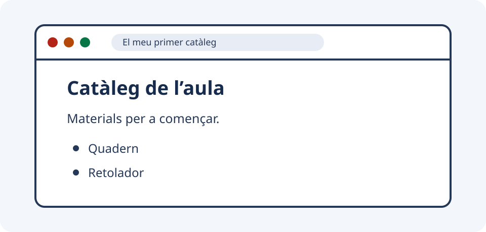

# 0. Punt de partida: la primera pàgina web

Esta unitat inicia el curs des de zero. Durant **dues setmanes orientatives** aprendràs a reconéixer com s'organitza la informació en un document web, a crear un primer fitxer HTML i a comprovar-ne el resultat. No pressuposa experiència amb programació, Git ni cap eina de línia d'ordres.

<div class="grid cards" markdown>

-   **Hui · primera sessió**

    ---

    Amb només un editor de text pla i un navegador, crearàs, guardaràs i obriràs la teua primera pàgina.

-   **Després · continuar la unitat**

    ---

    Relacionaràs estructura i aparença, reconeixeràs formats habituals i aplicaràs el que has fet en un minirepte.

</div>

## Propòsit i resultats observables

Una pàgina web no comença amb disseny: comença amb **informació** i amb una manera d'identificar cada part. En acabar la unitat podràs:

- [ ] crear i localitzar un fitxer HTML en una carpeta;
- [ ] obrir-lo al navegador, modificar-lo amb un editor de text pla i comprovar el canvi;
- [ ] identificar un títol, un paràgraf i una llista en una pàgina;
- [ ] explicar, amb un exemple, la diferència entre **estructura** i **aparença**;
- [ ] revisar el nom, l'extensió i la codificació d'un fitxer quan el resultat no siga l'esperat;
- [ ] reconéixer per a què s'usen HTML, XML, JSON, YAML, TOML i Markdown, sense haver-ne de dominar la sintaxi.

!!! note "Abast de la unitat"
    La duració de dues setmanes és una proposta de treball per al grup, no un nombre d'hores oficial. HTML s'aprofundirà en la unitat següent; ací construïm la base per començar amb seguretat.

## Hui: primera sessió

**Necessites:** un ordinador, un **editor de text pla** i un **navegador**. Un editor de text pla guarda caràcters sense el format d'un processador de textos; el navegador és el programa que interpreta una pàgina web i la mostra.

No has d'instal·lar res ni preparar cap compte. Si no saps crear una carpeta o guardar un fitxer, seguix els passos i demana ajuda en el moment en què et quedes.

### Abans d'escriure: ordenem una nota

En un taller fictici apareix esta informació seguida:

```text title="Nota de partida"
Catàleg de l’aula Materials per a començar. Quadern Retolador
```

**Pensa-ho un minut:** quina part és el títol? Quina explica el contingut? Quines paraules formarien una llista?

??? success "Una possible organització"
    - **Títol:** Catàleg de l’aula
    - **Presentació:** Materials per a començar.
    - **Llista de materials:** Quadern i Retolador.

    La informació no ha canviat: ara se'n veuen les parts i la funció.

### Dos conceptes per començar

| Concepte | Significat | Exemple en la nota |
|---|---|---|
| **Estructura** | L'organització i la funció de les parts d'un document. | Saber que «Catàleg de l’aula» és un títol i que els materials formen una llista. |
| **Aparença** | La manera visual com es mostra eixa estructura. | Veure el títol més gran o una marca davant de cada material. |

Hui ens centrarem en l'estructura. El navegador aplicarà una aparença bàsica; més avant treballarem com controlar-la.

### Prepara el fitxer

Un **fitxer** és un document guardat amb un nom. Una **carpeta** agrupa fitxers. L'**extensió** és la part final del nom —per exemple, `.html`— i ajuda les aplicacions a identificar el tipus de document.

1. Obri el gestor de fitxers (Explorador de fitxers, Finder o una aplicació equivalent) i crea una carpeta anomenada `unitat-0` en la ubicació que indique l'aula.
2. Obri l'editor de text pla i crea un document buit.
3. Copia exactament el codi de l'apartat següent.

!!! warning "Text pla, no document de Word"
    No guardes el document com a `.docx`, `.odt` o `.rtf`. Necessitem text pla amb extensió `.html`. En TextEdit, per exemple, usa **Format → Convertix a text sense format** abans d'escriure.

### Primer exemple HTML: catàleg de l'aula

**HTML** és un llenguatge de marques: afegix indicacions al text per identificar les parts d'un document web. Estes indicacions s'escriuen entre els signes `<` i `>`.

```html title="primera-pagina.html"
<!doctype html>
<html lang="ca">
  <head>
    <meta charset="UTF-8">
    <meta name="viewport" content="width=device-width, initial-scale=1">
    <title>El meu primer catàleg</title>
  </head>
  <body>
    <h1>Catàleg de l’aula</h1>
    <p>Materials per a començar.</p>
    <ul>
      <li>Quadern</li>
      <li>Retolador</li>
    </ul>
  </body>
</html>
```

Guarda'l dins de `unitat-0` amb el nom complet **`primera-pagina.html`**. Si l'editor et pregunta la codificació, tria **UTF-8**: és una manera de guardar els caràcters que conserva accents com el de «Catàleg».

Obri el fitxer amb el navegador. Pots fer clic amb el botó dret i triar **Obri amb**, o arrossegar-lo a una finestra del navegador. És un **fitxer local**: està al teu ordinador, no està publicat a Internet i no necessita connexió.

<div class="grid cards" markdown>

-   **Compara el codi executable**

    ---

    [Obri `primera-pagina.html`](../assets/unitat-0/primera-pagina.html) i comprova que coincidix amb el bloc anterior.

-   **Compara el resultat esperat**

    ---

    [Veu el resultat de la pàgina (SVG)](../assets/unitat-0/primera-pagina.svg). Hauries de veure un títol, un paràgraf i dos elements de llista.

</div>



**Observa també la pestanya:** ha de dir «El meu primer catàleg». Este text no apareix dins de la pàgina.

### Pràctica guiada: canvia, guarda i recarrega

Ara comprovaràs el cicle bàsic de treball, sense escriure cap element nou.

1. En l'editor, substituïx només `Quadern` per `Carpeta`.
2. Guarda el fitxer.
3. Torna al navegador i usa el botó **Recarrega**.
4. Comprova que la llista diu «Carpeta» i «Retolador».

**Resultat observable:** veus el canvi en el navegador. **Criteri d'èxit:** pots explicar que l'editor modifica el fitxer, guardar actualitza el fitxer al disc i recarregar fa que el navegador el torne a llegir.

!!! tip "Dos accions diferents"
    **Guardar** no actualitza automàticament el que ja està obert al navegador. **Recarregar** no guarda el que encara està pendent a l'editor. Normalment necessites fer les dues coses.

### Llig el primer exemple

Una **etiqueta** és una marca d'HTML, com `<p>`. En molts elements hi ha una etiqueta d'obertura, contingut i una etiqueta de tancament amb una barra: `<p>Materials per a començar.</p>`. El conjunt forma un **element HTML**.

[Obri el diagrama d'una etiqueta HTML (SVG)](../assets/unitat-0/etiqueta-html.svg).


| Peça | Funció en este exemple |
|---|---|
| `<!doctype html>` | Indica que el document usa HTML actual. |
| `<head>` | Agrupa informació sobre la pàgina, com el text de la pestanya. |
| `<title>` | Dona nom a la pestanya del navegador. |
| `<body>` | Conté el contingut que veiem en la pàgina. |
| `<h1>` | Marca el títol principal. |
| `<p>` | Marca un paràgraf. |
| `<ul>` i `<li>` | Formen una llista sense numeració i cadascun dels seus elements. |

No cal memoritzar estes etiquetes hui. Només relaciona cada marca amb el que veus. Els espais al principi de les línies ajuden a llegir el codi; no són una manera de col·locar elements a la pantalla.

## Continuem la unitat: estructura, aparença i fitxers

### Estructura no és aparença

L'element `<h1>` diu que un text és el títol principal: això és estructura. Que es veja gran i en negreta és l'aparença que el navegador aplica per defecte. **CSS** és el llenguatge que usarem més avant per decidir l'aparença; encara no l'hem afegit.

Esta separació és útil professionalment: podem canviar l'aspecte d'un catàleg sense perdre quin text és el títol, el paràgraf o la llista.

### Nom, extensió, codificació i text

La **codificació** és la regla que relaciona caràcters i les dades guardades en un fitxer. Guardar en UTF-8 i declarar `<meta charset="UTF-8">` ajuda que l'editor i el navegador interpreten igual accents i altres caràcters.

| Què revises? | Exemple correcte | Per què importa? |
|---|---|---|
| Nom i extensió | `primera-pagina.html` | El navegador reconeix que ha d'interpretar HTML. |
| Tipus de contingut | Text pla | Les etiquetes es guarden com a text que el navegador pot llegir. |
| Codificació | UTF-8 i `charset="UTF-8"` | Els accents es mostren com esperes. |

!!! warning "Canviar el nom no transforma el contingut"
    Reanomenar un fitxer no canvia les seues marques ni les seues regles. Un HTML anomenat `.json` continua contenint HTML i no es convertix en dades JSON.

## Diagnòstic inicial: si alguna cosa falla

Quan el resultat no siga l'esperat, no canvies moltes coses alhora. Compara, prova una causa i torna a observar.

| Què observes? | Primera comprovació |
|---|---|
| Encara apareix «Quadern». | Has guardat en l'editor i recarregat en el navegador? |
| El canvi no apareix. | Estàs editant i obrint el mateix fitxer de `unitat-0`? |
| S'obri l'editor en lloc del navegador. | Usa **Obri amb** i selecciona un navegador. |
| Veus les etiquetes com a text. | Revisa que el nom no acabe en `.html.txt` i que siga text pla. |
| Els accents són signes estranys. | Revisa UTF-8 en guardar i `charset="UTF-8"` en el document. |
| La llista o un text falta. | Compara amb el model: pot faltar un `<`, un `>` o un tancament. |

!!! note "Una pàgina visible pot tindre errors"
    Els navegadors intenten mostrar HTML encara que hi haja errors. En esta unitat, compara amb el model i descriu què observes. Més avant utilitzarem eines per comprovar les regles del document.

Per demanar ajuda, indica **què volies veure, què veus i què ja has provat**. Per exemple: «He canviat Quadern per Carpeta, he guardat i he recarregat, però potser estic obrint un altre fitxer».

## Panorama de formats: reconéixer, no dominar

Un **format** indica com s'organitza la informació dins d'un fitxer. La **sintaxi** són les regles concretes per escriure eixe format. Ara no has d'escriure JSON, YAML ni XML: només has de reconéixer usos habituals.

| Format | Ús habitual | Idea clau per ara |
|---|---|---|
| **HTML** (`.html`) | Pàgines web. | Marca parts com títols, paràgrafs i llistes. |
| **XML** (`.xml`) | Documents i intercanvi de dades. | Usa marques amb noms adaptats a la informació. |
| **JSON** (`.json`) | Dades entre aplicacions. | Representa dades; no descriu per si mateix una pàgina web. |
| **YAML** (`.yaml` o `.yml`) | Configuració d'eines. | Els espais inicials poden tindre significat. |
| **TOML** (`.toml`) | Configuració d'eines. | Relaciona noms d'opcions amb valors. |
| **Markdown** (`.md`) | Apunts i instruccions en text. | Usa marques senzilles, com `#` per a un títol. |

**Com decideixes?** Pensa qui llegirà el fitxer i què necessita: un navegador que ha de mostrar un catàleg necessita HTML; una aplicació que demana JSON necessita JSON. L'extensió sola no fa la conversió.

### Activitat de reconeixement

Tria un format i justifica cada decisió amb una frase:

1. Mostrar un títol i una llista en una pàgina web.
2. Enviar una llista de materials a una aplicació que demana explícitament JSON.
3. Escriure instruccions breus en text amb títols i llistes.

??? success "Orientació per contrastar"
    1. **HTML**, perquè el navegador interpreta les marques d'una pàgina web.
    2. **JSON**, perquè és el format que l'aplicació ha indicat.
    3. **Markdown** és adequat per a instruccions senzilles en text. La raó és l'ús, no una preferència personal.

## Minirepte: una pàgina per a un taller fictici

**Objectiu:** adaptar l'exemple perquè una altra persona puga llegir els materials d'una activitat fictícia.

**Punt de partida:** la teua `primera-pagina.html`, que ja has obert i modificat.

1. Usa **Guarda com** per crear `taller.html` dins de `unitat-0`.
2. Tria una activitat fictícia, com preparar una exposició o construir una maqueta.
3. Canvia el títol de la pestanya, el títol principal i el paràgraf perquè descriguen l'activitat.
4. Substituïx la llista per tres materials adequats a l'activitat. No uses dades personals ni informació real de l'alumnat.
5. Guarda, obri `taller.html` al navegador i recarrega.

**Resultat observable:** una pàgina local amb un títol principal, un paràgraf i tres elements de llista, sense etiquetes visibles com a text.

**Criteris d'èxit:**

- [ ] El fitxer és `taller.html`, no `taller.html.txt`.
- [ ] El títol de la pestanya i el títol de la pàgina no tenen per què ser iguals, però identifiquen l'activitat.
- [ ] Hi ha tres materials coherents amb l'activitat fictícia.
- [ ] Els accents es veuen correctament.
- [ ] Has guardat i recarregat després de l'últim canvi.
- [ ] Pots explicar un canvi que hages comprovat.

??? tip "Si necessites una pista"
    No canvies els noms de les etiquetes. Canvia només el text entre `title`, `h1`, `p` i cada parella `li`.

## Autoavaluació

Intenta respondre sense mirar els apartats anteriors. Després desplega les respostes i torna al punt que necessites repassar.

1. Quines dues eines has usat per crear i veure una pàgina?
2. Quina diferència hi ha entre estructura i aparença?
3. Què fa `title` i què fa `h1`?
4. Has canviat un material, però el navegador encara mostra l'anterior. Quines dues accions comprovaries primer?
5. Què revisaries si el fitxer es diu `taller.html.txt`?
6. Per què convé usar UTF-8 en guardar i en la declaració HTML?
7. Si una aplicació demana JSON, basta canviar `.html` per `.json`?

??? success "Respostes breus"
    1. Un editor de text pla per escriure i guardar, i un navegador per interpretar i mostrar HTML.
    2. L'estructura identifica la funció de cada part; l'aparença és com es veu.
    3. `title` dona nom a la pestanya; `h1` és el títol principal dins de la pàgina.
    4. Guardar en l'editor i recarregar en el navegador. Després, comprovaria que és el mateix fitxer.
    5. El nom complet i el tipus de guardat: ha de ser text pla amb extensió `.html`, sense `.txt` final.
    6. Perquè l'editor guarde i el navegador llija igual els caràcters, inclosos els accents.
    7. No. Canviar l'extensió no transforma el contingut ni les seues regles.

## Resum operatiu i continuació

**Organitzar → marcar → guardar → obrir → recarregar → comparar.**

- HTML identifica la funció del contingut; encara no hem decidit el disseny.
- L'editor modifica el fitxer i el navegador en mostra el resultat.
- El nom, l'extensió, el text pla i UTF-8 són comprovacions útils quan alguna cosa falla.
- Els formats tenen usos diferents; primer cal identificar qui llegirà la informació i per a què.

En la [unitat 1: HTML semàntic i accessible](01-html-semantic.md) ampliarem esta base per crear documents web més complets i accessibles.

### Recursos per continuar

- [MDN: conceptes bàsics d'HTML, en castellà](https://developer.mozilla.org/es/docs/Learn_web_development/Getting_started/Your_first_website/Creating_the_content): explicacions i exemples per repassar.
- [HTML Living Standard — WHATWG, en anglés](https://html.spec.whatwg.org/): referència tècnica; no cal llegir-la per completar la unitat.
- [Itinerari del curs](index.md): situa les pròximes unitats i els formats que treballarem més avant.
